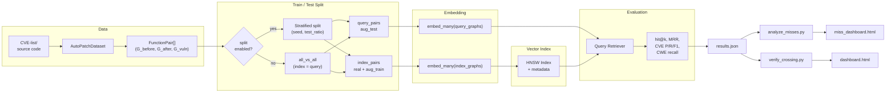
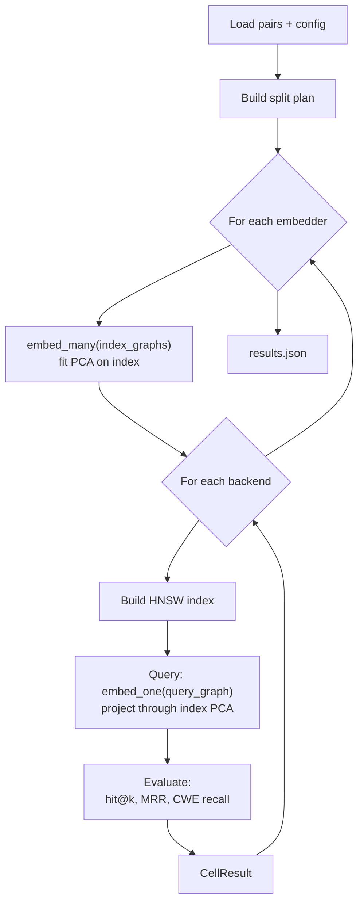
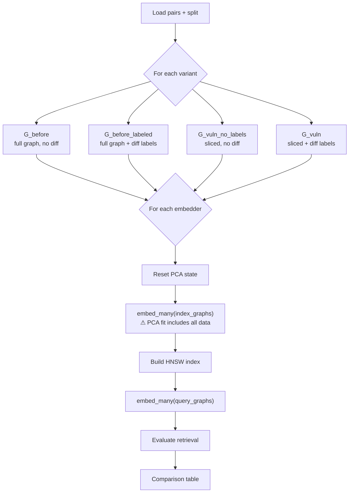
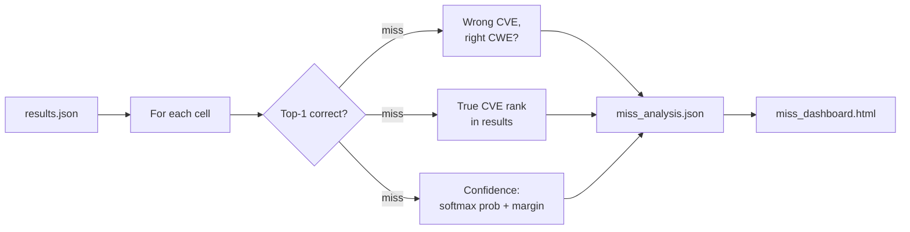
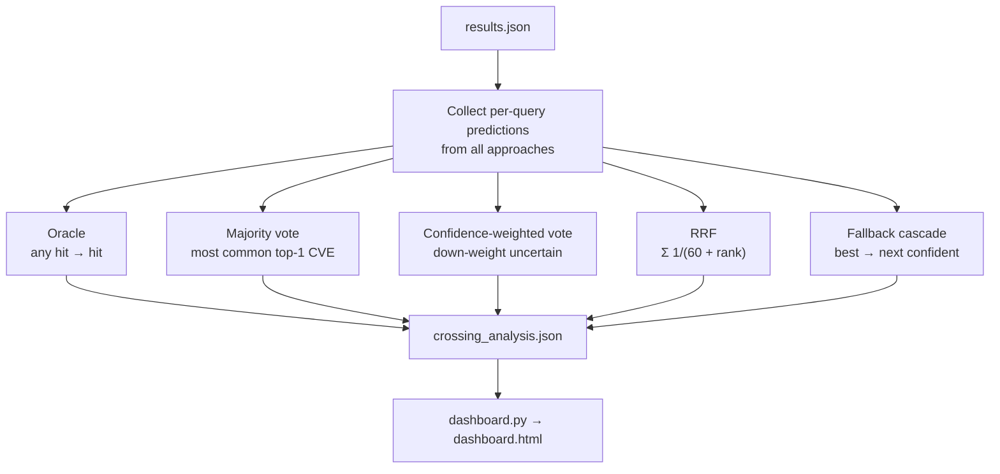
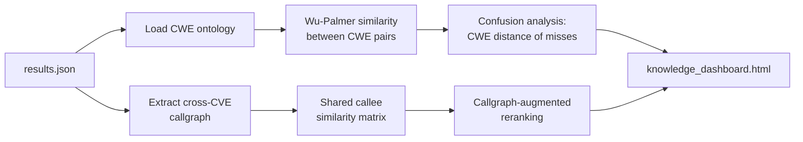

# Experiments

This directory contains the evaluation pipeline for the graph-RAG retrieval system. The goal is to answer a concrete question: *given a vulnerable function, can the system retrieve the correct CVE from a corpus?* The pipeline runs multiple embedding approaches against multiple retrieval backends, measures how well each one does, and then asks whether combining them can recover the cases any single approach misses.

---

## End-to-end pipeline



---

## Experiment scripts

### `runner.py` — main grid experiment

Sweeps a grid of `(embedder × backend)` cells. Each cell embeds the corpus, builds an ANN index, and evaluates retrieval.



**Key detail — asymmetric query protocol:**
- Augmented queries use `G_before` (full pre-patch graph, no diff labels)
- Original queries use `G_vuln` (sliced + diff-labeled)
- PCA is fitted once on index embeddings and applied unchanged to queries
- Each query is embedded individually via `embed_one()`

A "cell" records: embedding cost, index build time, query latency (p50/p95/p99), space stats, self-retrieval (Hit@1/5/10, MRR), CWE recall, leave-one-out (optional), and raw per-query results.

---

### `slicing_comparison.py` — graph variant ablation

Compares four graph representations in a 2×2 factorial design (slicing × labelling):



**⚠ Known issue:** This script resets PCA per variant and batch-embeds queries alongside index data. This causes PCA to be fitted on query+index jointly, which leaks information. The correct protocol (used by `runner.py`) fits PCA on index only and projects queries through that same PCA.

Query variant options:
- Default: queries use the same graph variant as the index
- `--query-variant runner_compat`: reproduces `runner.py`'s asymmetric protocol (The query always use G_before for querying)
- `--query-variant G_before`: fixes all queries to `G_before`

---

### `analyze_misses.py` — failure analysis

Takes `results.json` and analyses retrieval failures:



Produces:
- `miss_analysis.json` — structured per-cell miss/uncertainty statistics
- `miss_dashboard.html` — standalone HTML with charts and tables

---

### `verify_crossing.py` — fusion strategies

Tests whether combining embedders recovers individual misses:



The cascade order is computed automatically — approaches sorted by Hit@1.

---

### `knowledge_experiment.py` — CWE ontology + callgraph

Adds domain knowledge on top of retrieval results:



---

### `dashboard.py` — unified HTML dashboard

Reads all analysis JSONs and produces a single self-contained `dashboard.html` with four tabs:

| Tab | Content |
|---|---|
| **Overview** | Hit@1, MRR leaderboard across all approaches |
| **Deep Dive** | Per-approach charts (latency, space stats, miss breakdown) |
| **Crossing Strategies** | Fusion comparison, complementarity heatmap |
| **Code Explorer** | Query-by-query inspection with source code |

---

## Quick start

All scripts run from the **repo root**:

```bash
# 1. Full grid experiment
uv run python -m experiments.runner

# 2. Slicing methodology comparison
uv run python -m experiments.slicing_comparison --config config.yaml --query-variant runner_compat

# 3. Miss analysis
uv run python experiments/analyze_misses.py experiments/output/<run_id>/results.json

# 4. Fusion strategies + dashboard
uv run python experiments/verify_crossing.py experiments/output/<run_id>/results.json
```

---

## Output structure

```
experiments/output/<run_id>/
├── results.json              # runner.py output
├── slicing_comparison.json   # slicing_comparison.py output
├── miss_analysis.json        # analyze_misses.py output
├── crossing_analysis.json    # verify_crossing.py output
├── dashboard.html            # unified dashboard
├── miss_dashboard.html       # miss-specific dashboard
├── knowledge_dashboard.html  # knowledge experiment dashboard
└── indices/                  # HNSW index files
    ├── <embedder>__<variant>__hnsw.index
    └── <embedder>__<variant>__hnsw_meta.json
```

---

### `metrics.py`

Utility functions used by `runner.py`. Self-retrieval metrics (Hit@k, MRR), embedding space statistics (mean pairwise similarity, intrinsic dimensionality), and leave-one-out evaluation.

---

### `visualization.py`

Generates static matplotlib/seaborn figures for a run:

- Performance dashboard (embedding cost, latency)
- Retrieval quality dashboard (Hit@k bars, MRR)
- Embedding space dashboard (UMAP projection, similarity distribution)
- Combined comparison across all cells

These land in `output/<run_id>/visualizations/`.

---

### `visualize_diagnostics.py`

Reads the per-query diagnostic data and produces charts specifically about failure modes — where the true CVE lands when missed, confidence distributions, CWE-level patterns.

---

## Output directory structure

```
experiments/output/<run_id>/
    results.json            — raw experiment results (all cells, all queries)
    summary.json            — high-level stats (generated by runner)
    miss_analysis.json      — miss/uncertainty breakdown (from analyze_misses.py)
    crossing_analysis.json  — fusion strategy results (from verify_crossing.py)
    dashboard.html          — unified interactive dashboard
    miss_dashboard.html     — miss-focused dashboard
    indices/                — saved FAISS/HNSW index files
    visualizations/         — static PNG figures
    diagnostics/            — per-approach diagnostic JSON files
```

---

## Reading the results

### Hit@1 and MRR

Hit@1 is the fraction of queries where the correct CVE is the very first result. It's the strictest and most useful metric — in a real workflow, you'd look at the top result and decide whether it matches. MRR (Mean Reciprocal Rank) is softer: if the correct CVE is at rank 3, it still gets a score of 1/3.

A random baseline on a corpus of N items would score roughly 1/N on Hit@1. The numbers here should be dramatically better than that.

### Fusion strategies — what the numbers mean

The oracle rate tells you the *ceiling* for this set of approaches — it answers "if we had a perfect oracle to pick the right approach for each query, what's the best we could do?" The gap between oracle and individual_best is the potential gain from better combination.

The other strategies are attempts to close that gap without cheating. RRF tends to be robust and is a good default — it doesn't need any uncertainty estimates, just the ranked lists. The fallback cascade is more aggressive: it bets on the best single approach and only falls back when that approach looks shaky.

If majority_vote beats individual_best, that's a signal the approaches are genuinely diverse and a consensus is valuable. If it doesn't, the approaches are probably making the same mistakes.

### Pairwise complementarity

The table in the Crossing Strategies tab shows, for every pair of approaches, the union Hit@1 — i.e., what fraction of queries at least one of the two gets right. Numbers in parentheses (e.g. `6+`) are queries that approach B rescues from approach A's misses.

High union rates with high individual rates means the approaches agree. High union rates with *lower* individual rates means they're complementary — each catches different cases. That's where fusion is most valuable.

### Combined miss deep-dive

"Combined" refers to the best-performing individual approach. The deep-dive table lists every query that approach got wrong and shows:

- How far down the true CVE was (if it appeared at all)
- Whether the approach was uncertain on that query
- Which other approaches got it right
- Which fusion strategies recovered it

If most misses have `rescued_by=[]`, the whole ensemble is struggling on those queries — likely hard cases where the code is ambiguous or the embedding space just doesn't separate them well.

---

## Adding a new embedder

1. Implement the embedder in `src/embeddings/` following the existing interface
2. Register it in `src/embeddings/__init__.py` via `build_embedders()`
3. Re-run `experiments/runner.py` — it'll pick it up automatically

---

## Adding a new fusion strategy

1. Write a function in `verify_crossing.py` that takes `per_approach: dict[str, dict]` and returns the predicted CVE string (or `None`)
2. Add its name to the `strategies` list and call it in the per-query loop, following the existing pattern
3. Re-run `verify_crossing.py` — the dashboard will include it automatically
