# Embedders

Graph embedding pipeline for vulnerability retrieval. Each embedder converts a CPG (Code Property Graph) into a fixed-dimensional vector suitable for ANN search.

---

## Architecture overview

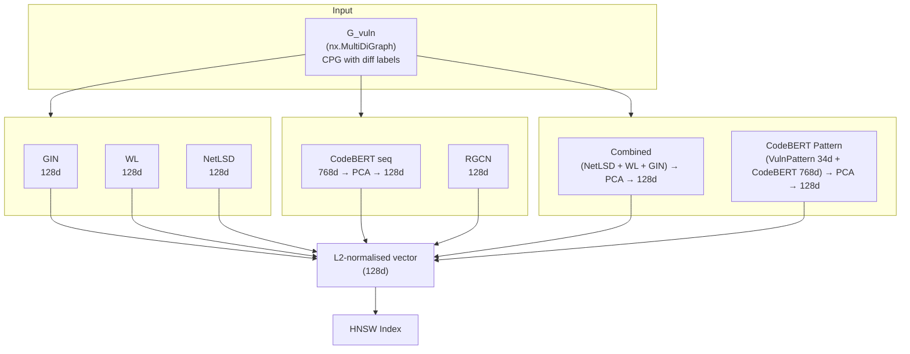

---

## Embedding pipeline per graph

Every embedder follows the same contract defined in `base.py`:

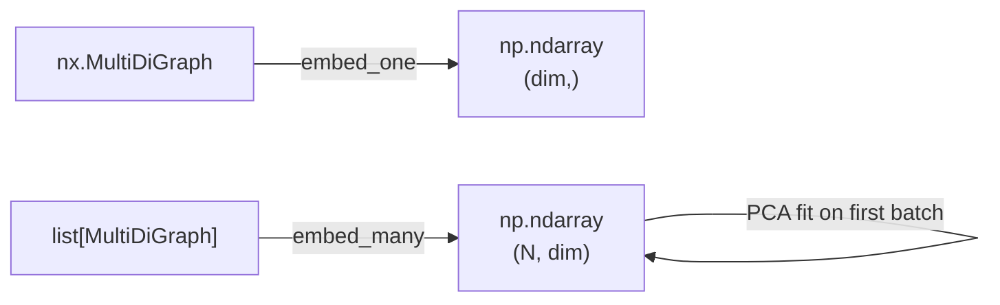

- `embed_many()` is called first on index graphs — this fits PCA if the embedder uses it
- `embed_one()` projects through the already-fitted PCA (for query-time embedding)
- All outputs are L2-normalised so cosine similarity = dot product

---

## Structural embedders

These operate on graph topology and node types. They do **not** use pretrained language models.

### GIN (Graph Isomorphism Network)

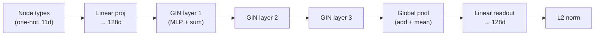

- **Input:** one-hot node type (METHOD, CALL, IDENTIFIER, etc.)
- **Random weights** — frozen, no training. Random MLP weights in GIN still produce structurally discriminative embeddings
- **Why it works:** GIN is provably as powerful as the WL test for graph isomorphism. Two graphs with different local structure produce different embeddings

### WL (Weisfeiler-Lehman)

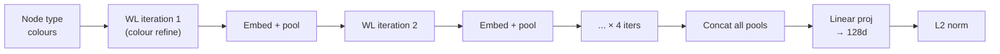

- **Input:** integer node colour from type index
- **4 iterations** of colour refinement → embedding lookup → sum pooling per iteration
- Concatenates all iteration outputs → linear projection

### NetLSD (Network Laplacian Spectral Descriptor)

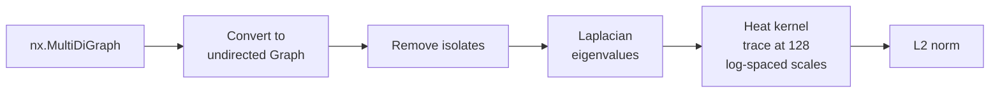

- Purely spectral — encodes global graph shape, not node content
- Timescales from $10^{-2}$ to $10^{2}$
- Fast but least discriminative (no node features, no diff labels)

---

## Semantic embedders

### CodeBERT seq

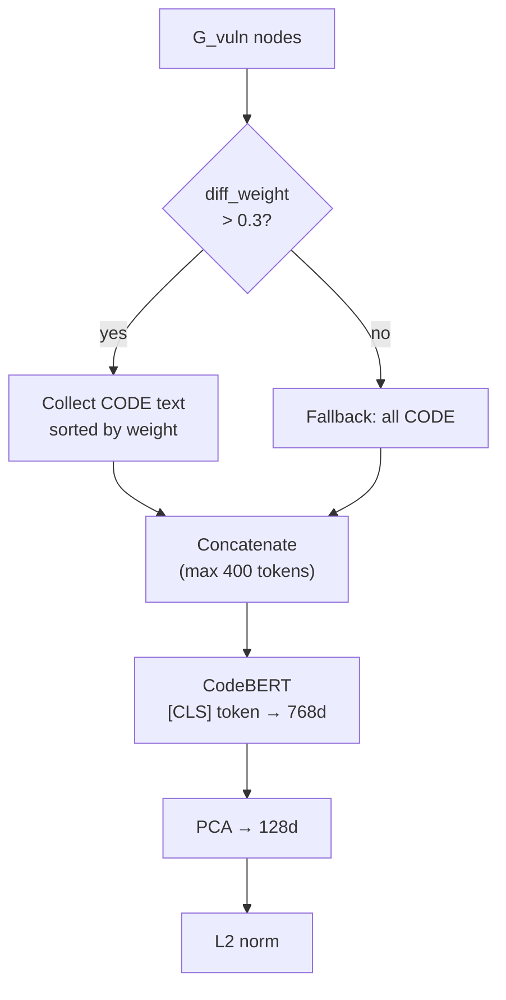

- **Text-only** baseline — no graph structure used
- Filters nodes by `diff_weight > 0.3` (keeps `removed`, `fix_adjacent`, `edge_changed`; drops `context`)
- Sorts by importance (weight descending) then line number
- PCA fitted on first `embed_many()` call

### RGCN (Relational Graph Convolutional Network)

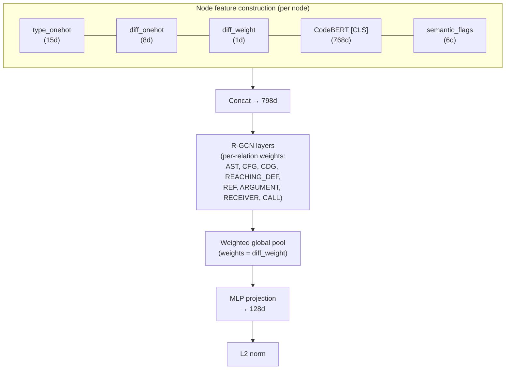

- **Heterogeneous edges** — separate weight matrix per edge type (8 relation types)
- **Rich node features** — combines structural type, diff annotations, CodeBERT code embedding, and semantic flags (pointer ops, alloc/free, lock/unlock, checks, code length)
- **Weighted pooling** — nodes with higher diff_weight contribute more to the global embedding
- Frozen random weights (no training)
- Graphs > 200 nodes are trimmed (keep highest diff_weight + degree)

Semantic flags extracted from CODE text per node:
| Flag | Pattern |
|---|---|
| Pointer op | `*var`, `->` |
| Allocation | `malloc`, `alloc`, `new` |
| Free | `free`, `kfree`, `delete` |
| Lock | `mutex_lock`, `spin_lock` |
| Check | `if`, `assert`, `BUG_ON` |
| Code length | `len(words) / 20` |

---

## Fusion embedders

### Combined (NetLSD + WL + GIN → PCA)

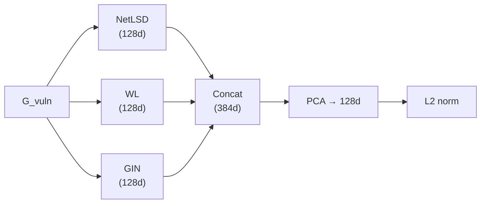

- Concatenates three structural embedders, then PCA-reduces
- PCA fitted on first `embed_many()` batch
- **Best structural-only performer** — benefits from each sub-embedder capturing different graph properties (spectrum, colour refinement, message passing)

### CodeBERT Pattern (VulnPattern + CodeBERT → PCA)

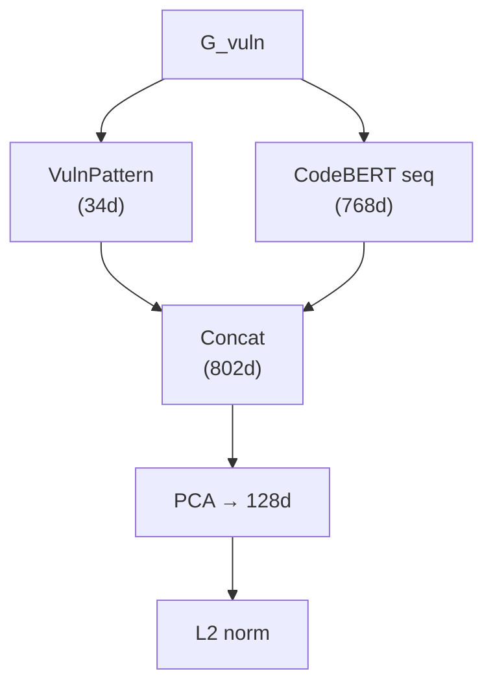

**VulnPattern** extracts 34 vulnerability-specific structural features in 5 groups:

| Group | Dims | What it captures |
|---|---|---|
| A. Vulnerability flow patterns | 8 | UAF (free→use via REACHING_DEF), NPD (deref without CDG guard), unchecked return, lock imbalance, arithmetic without bounds, use-without-def, alloc/free imbalance, cast connected to changes |
| B. Diff edge composition | 8 | Fraction of each edge type touching changed nodes |
| C. Boundary flow direction | 6 | CFG/CDG/REACHING_DEF edges crossing changed↔context boundary |
| D. Diff topology | 6 | Change density, connected components, degree distribution, internal vs crossing edges |
| E. Changed node roles | 6 | Distribution of CALL, CONTROL_STRUCTURE, IDENTIFIER, LITERAL, BLOCK among changed nodes |

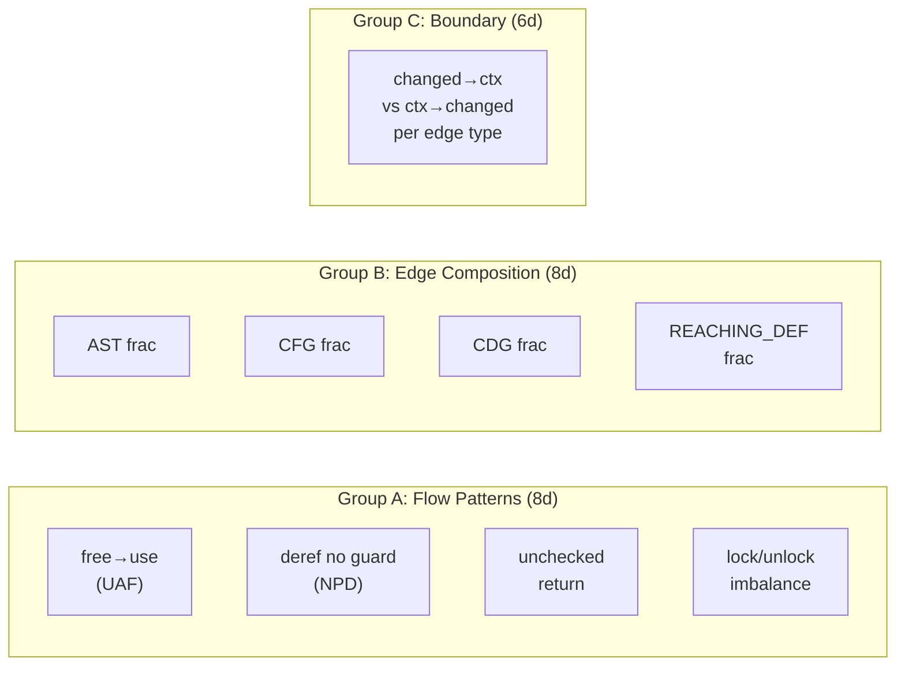

**Key ablation:** If CodeBERT Pattern beats CodeBERT seq → graph structure adds value. If it beats VulnPattern alone → CodeBERT adds value.

---

## Node feature pipeline (used by GIN, WL, RGCN)

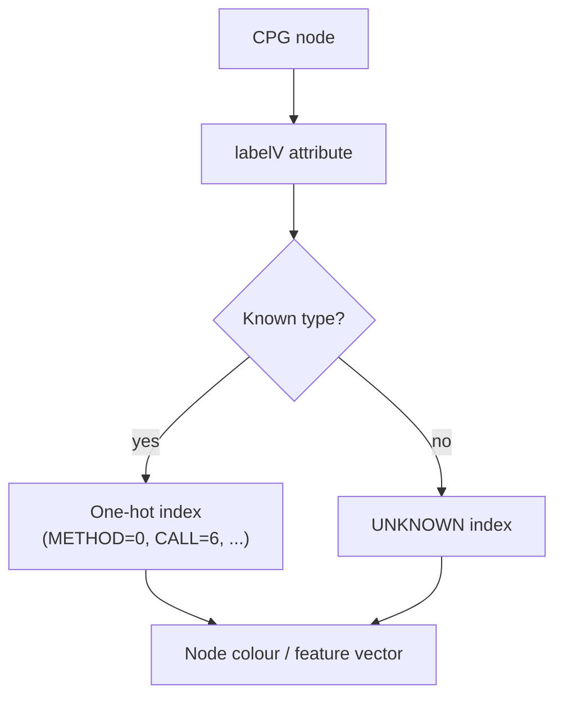

Node types used across embedders:
```
METHOD, METHOD_PARAMETER_IN, BLOCK, LOCAL, CALL,
IDENTIFIER, LITERAL, RETURN, CONTROL_STRUCTURE,
FIELD_IDENTIFIER, UNKNOWN
```

RGCN extends this with diff labels and CodeBERT features. GIN and WL use only the type one-hot.

---

## Diff annotation features

Embedders that use diff annotations get node-level labels from `compute_graph_diff()`:

| Label | Weight | Meaning | Used by |
|---|---|---|---|
| `removed` | 1.0 | Code deleted by patch | All (as feature) |
| `fix_adjacent` | 0.8 | Neighbour of inserted fix | RGCN (weight), CodeBERT seq (filter) |
| `edge_changed` | 0.6 | Endpoint of changed edge | RGCN (weight), CodeBERT seq (filter) |
| `context` | 0.2 | Unchanged, reached by BFS | All (as feature or ignored) |

How each embedder uses diff info:
- **RGCN** — diff_onehot as node feature + diff_weight for weighted global pooling
- **CodeBERT seq** — filters nodes with `diff_weight > 0.3`, sorts by weight
- **GIN, WL** — diff label used as categorical node feature (when present on G_vuln)
- **NetLSD** — ignores diff labels entirely (spectral only)

---

## PCA behaviour

Several embedders use PCA for dimensionality reduction. The PCA lifecycle:

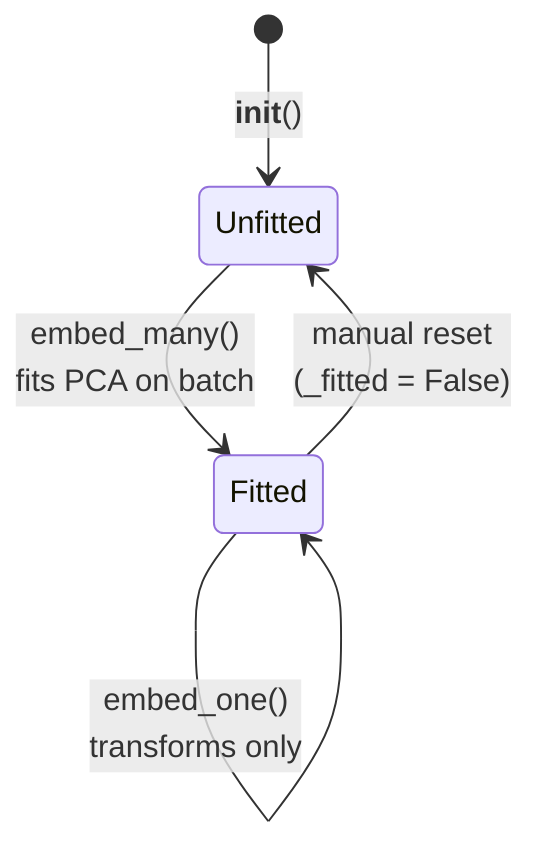

**Correct protocol for evaluation:**
1. Call `embed_many(index_graphs)` — fits PCA on index distribution
2. Call `embed_one(query_graph)` for each query — projects through index PCA
3. Never refit PCA on query data (information leakage)

Embedders with PCA: `combined`, `codebert_seq`, `codebert_pattern`, `vuln_pattern`, `rgcn`
